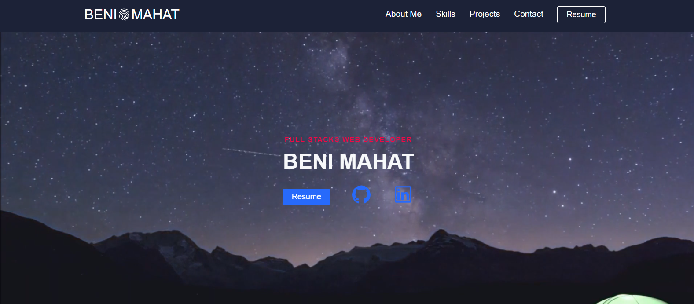

## Table of Contents

* [Description](#description)
* [Links](#links)
* [Screenshots](#screenshots)
* [Installation](#installation)
* [Usage](#usage)
* [Technologies Used](#technologies)
* [Questions](#questions)

## Description

This is my portfolio Webpage made January 2021. Plese explore my information and projects. 

## Links

[See the Deployed Application](https://benimahat1291.github.io/Portfolio_v2/)

## Screenshots

## Installation Instructions

run "npm i" in the command line

## Usage

Please explore my professional information
 

## Technologies Used

HTML, CSS, JS, Flexbox

## Questions

If you have further projects and questions, you can find me on Github: [GITHUB](https://github.com/benimahat1291). 
please visit my portfolio to find contact information: [BENI MAHAT](https://benimahat1291.github.io/Portfolio_v2/#/). 